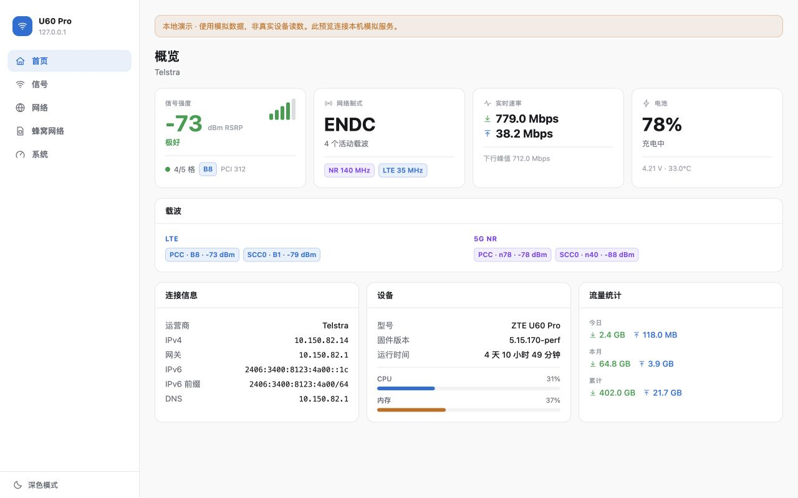
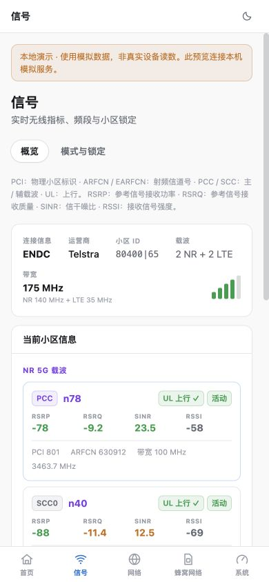
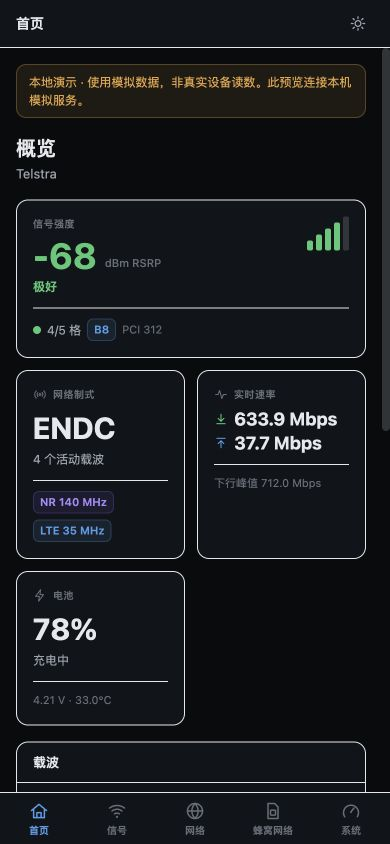

# WebUI 简体中文本地交付

日期：2026-09-17。上游基线：`fabaf8b53678dc50e3c3fa2fa3de8b51061967cc`（v2.4 源码）。

- Fork：<https://github.com/ren2019/MU5250-OpenUI>
- 工作目录：`/Users/renzhen/projects/envs/zte-u60/MU5250-OpenUI-zh`
- 本地分支：`feat/webui-zh-cn`。此次源码改动保留在工作区，未提交或推送。
- 本地预览：<http://127.0.0.1:8088/?demo=1>，任意非空演示密码均可登录，如 `demo`。
- 预览使用仓库自带 mock；页面明确标注“本地演示”。Telstra、短信、Wi-Fi 7、信号、电池及速率均为模拟数据，不能用于判断飞猫 B25 U60 Pro 的实际能力或运行状态。

## 覆盖范围

| 区域 | 本轮汉化 |
| --- | --- |
| 登录与外壳 | 登录提示、密码/PIN 标签、失败提示、五组导航、主题切换、浏览器标题和页面语言 |
| 首页 | 信号、制式、速率、电池、连接、设备、流量和运行时长 |
| 信号 | 载波表/手机卡片、质量参考、指标说明、网络模式、频段/小区锁定、清除确认、诊断标签 |
| 网络 | 连接设备、Wi-Fi 查看与编辑、信道提示、同步配置、LAN/DHCP/DNS、重连与回退说明 |
| 蜂窝网络 | APN 模式/列表/表单/确认、流量周期与中文日期、TTL、短信列表/编写/删除提示 |
| 系统 | 温度、CPU、内存、电池健康、充电控制、日志、AT 安全说明、进程、USB、服务与电源操作 |
| 共用反馈 | 按钮、空状态、确认框、通知、输入校验、数据过期告警、常见认证/API 错误 |

RSRP、RSRQ、SINR、RSSI、PCI、ARFCN、PCC/SCC、UL 等缩写保留，并在信号页提供中文释义；APN、TTL 在对应页面提供释义。手机标签栏保留短标签 APN / TTL，避免长释义挤出“短信”。

## 实现与上游同步

直接修改 React 展示文案，不引入多语言依赖或语言切换状态。`src/display.ts` 仅映射后端状态的显示名称；`src/data/client.ts` 的 `errorLabel` 映射常见错误，并为未知错误保留原文和“服务返回”前缀。

API 字段、枚举、网络模式值、AT 命令、CSS 布局、轮询机制、权限和操作流程保持原样。检查了 72 处 `api.*` 调用表达式，与基线完全一致；`src/data/api.ts`、Rust agent、部署工具和安装器均未修改。

`DemoNotice` 仅在回环地址且 URL 含 `?demo=1` 时显示演示标识；它不切换 API、不注入模拟值、不影响设备地址上的界面。实际模拟服务由下面的独立命令启动。

同步 upstream 时，重点检查新增 JSX 文案、模板字符串、后端状态与错误类型；未知后端值会保留原文，不应为了汉化去改业务枚举。

## 本地复现

以下命令均在本项目的 `web-app` 子目录执行。Node 要求沿用上游：`^20.19.0 || >=22.12.0`。此次环境为 Node `v26.7.0`、npm `11.19.0`。

```sh
npm ci
npm run build
npm test
npm run lint
```

一个终端启动仅监听本机的模拟服务：

```sh
python3 -u -c 'from tools.mock_agent import Handler, ThreadingHTTPServer; ThreadingHTTPServer(("127.0.0.1", 9090), Handler).serve_forever()'
```

另一个终端启动静态预览：

```sh
npm run preview -- --host 127.0.0.1 --port 8088 --strictPort
```

访问 <http://127.0.0.1:8088/?demo=1>。每个终端按 Ctrl-C 停止相应服务。端口已被占用时先确认占用来源，不要终止不明进程。此次交付已启动上述两个本地服务。

## 验证结果

- `npm run build`：通过（包含 `tsc -b` 类型检查与 Vite 生产构建）。
- `npm test`：7/7 通过，包括原有轮询/LAN 确认测试，以及认证错误中文化、HTTP 状态/凭据保持不变、未知错误原文保留测试。
- `npm run lint`、`git diff --check`：通过。
- `python3 scripts/check-api-contract.py`：通过（agent 63 条路由，前端调用 58 条，mock 30 个显式桩；沿用上游契约覆盖）。
- React Doctor changed 扫描：56 分，7 项提示；为排除原有问题干扰，另对上游源码快照和当前源码分别运行 full 扫描，均为 **53 分、35 项问题（1 error、34 warnings）**，规则与数量一致。现有主题 state updater、副作用、复杂度、sessionStorage token、可访问性等问题未在汉化中重构。
- 本机浏览器实际走查：登录及全部 13 个主页面/标签页；另检查 Wi-Fi 编辑、APN 添加、短信编写、清除锁定确认后取消、按需加载进程和 TTL=0 的中文校验提示。
- 桌面预览及 390×844 手机视口检查：短标签修正后四个蜂窝标签均可见；首页和信号页没有页面级横向溢出；手机深浅色已查看。最终桌面截图为 1280×800。
- 浏览器本次会话 console：未记录 warning / error。

这些是本地 mock 和浏览器证据，不是实机业务验收。没有向 `192.168.0.1` 发请求，没有部署、重启路由器或修改真实网络/温控/充电设置，没有读取父目录 `.local` 凭据，也没有修改父目录 vendor。

## 保留原文与未验证部分

- 用户内容（短信正文、SSID、APN 名称）、运营商/产品名、技术值与单位、AT 原始响应、CSV 字段、进程名保持原文。
- 未知固件状态与未知诊断保留原文；并非穷尽所有固件错误的翻译。安装器、Rust 后端日志、上游文档不在此次 WebUI 汉化范围。
- 未做真实 B25 U60 Pro / 不同固件验收；没有验证物理手机 PIN 登录、真实短信收发、真实 LAN 回退、USB 切换、充电控制或电源操作。手机测试指浏览器视口测试。

## 构建产物与截图

- 静态目录：`web-app/dist/`，13 个文件，共 362,197 字节。
- 本地打包：`build/MU5250-OpenUI-web-zh-CN.tar.gz`（包根目录即静态站点内容）。
- SHA-256：`f377471e7719c3b417ca57e84396a14841840121349996e69ffa8a654ac2b48b`。
- 校验文件：`build/SHA256SUMS`，在项目根目录执行 `shasum -a 256 -c build/SHA256SUMS`。
- 已逐文件读取压缩包并与 `dist` 比对一致。`dist/` 和 `build/` 沿用上游忽略规则，仅本地交付。






